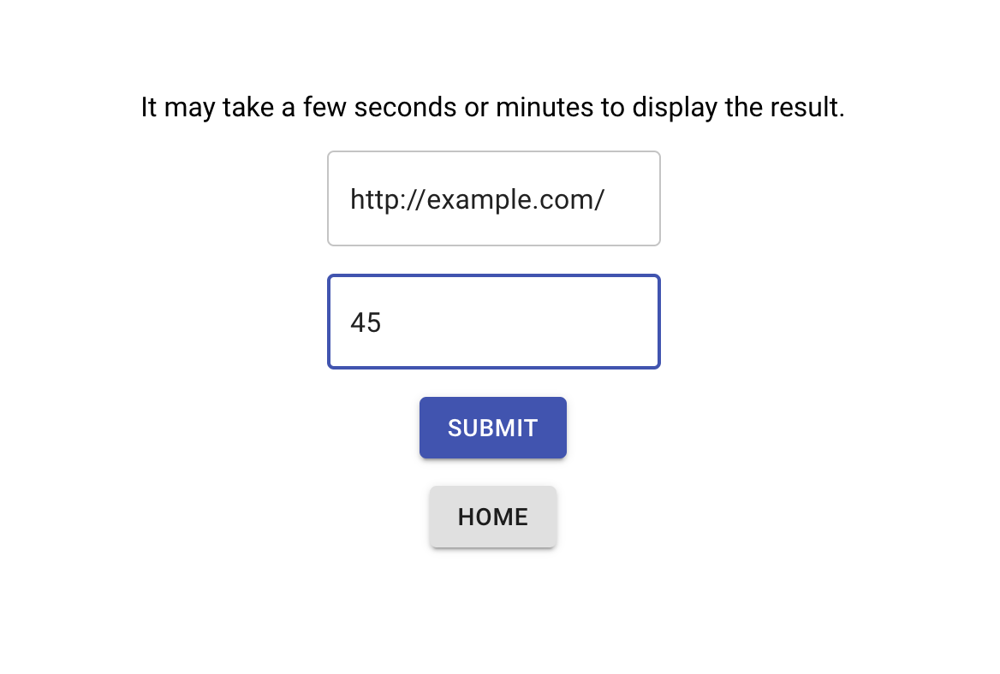
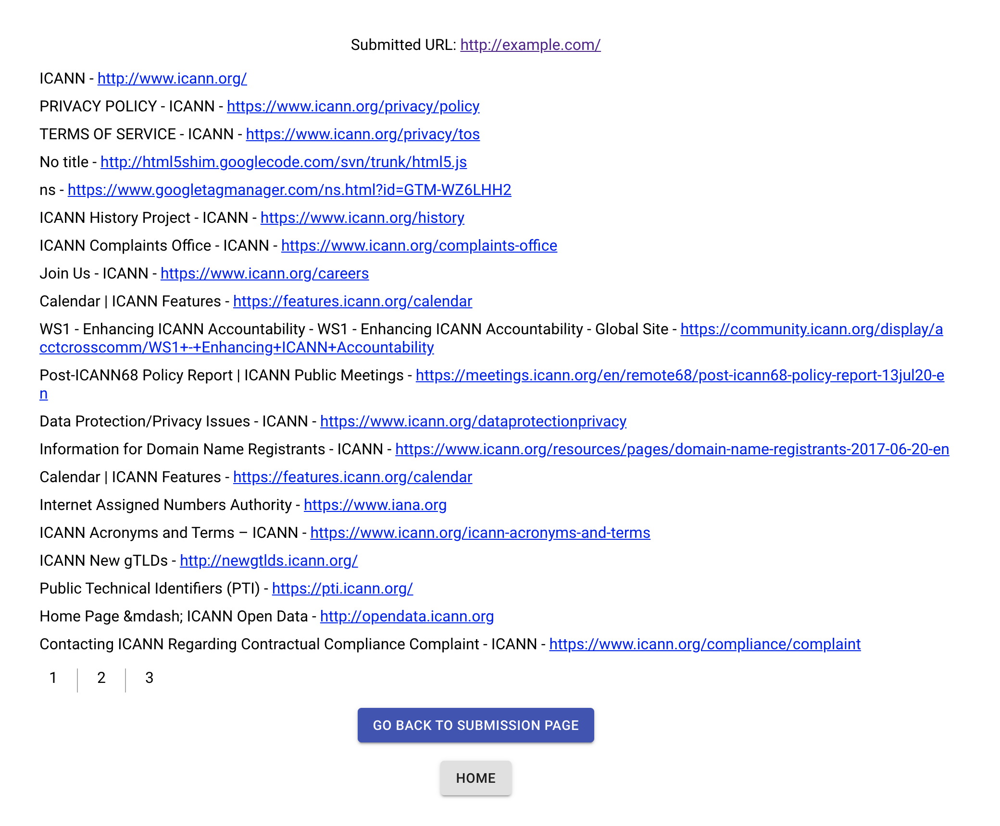

# Goolegle
A basic search engine.  
A web crawler program that crawls the given url, any link on the page, any links on those pages and so on.  
For each url, it outputs the title and the url. It stops crawling once it reaches to the given limit.  
It accepts a list of email addresses and returns an integer indicating the number of unique email addresses.  

The crawler crawl the pages concurrently and the output on the frontend is paginated.  
Backend: Python3  
Frontend: JavaScript(React)  

[http://localhost:3000/post](http://localhost:3000/post)

[http://localhost:3000/result](http://localhost:3000/result)
